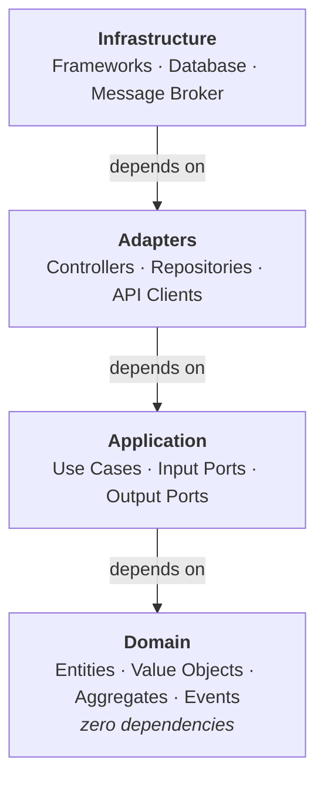

# Domain-Centric Architecture
*Synthesis of Domain-Driven Design, Hexagonal Architecture, and Clean Architecture*

Written by **Christoph Bloemer** (@chbloemer).

**Domain-Centric Architecture** is an architectural approach that puts **domain logic at the center** and protects it from infrastructure concerns. It synthesizes proven patterns from Domain-Driven Design, Hexagonal Architecture, and Clean Architecture.

## Key points

### Core Principles

1. **Dependencies Point Inward** - All code dependencies point toward the domain layer. The domain has zero outward dependencies.

2. **Domain is King** - Business logic lives in a rich domain model using tactical DDD patterns (Entities, Value Objects, Aggregates, Domain Services, Domain Events).

3. **Ports & Adapters** - Application layer defines interfaces (ports), infrastructure implements them (adapters). This inverts dependencies.

4. **Bounded Contexts** - Large systems are partitioned into bounded contexts, each with its own ubiquitous language and model.

5. **Decoupled Integration** - Bounded contexts stay independent: they communicate asynchronously, through integration events or another asynchronous channel, and synchronously only where the declared relationship says so — an open host service the downstream consumes and translates. Events are the means of decoupling, inside the model as domain events and across contexts as integration events, not an obligation on every interaction.

6. **Progressive Complexity** - Start simple with flat structures, add complexity only when needed based on actual pain points.

### Four Layers

### When to Use

**Ideal for:**
- Complex business domains with rich logic
- Systems that will evolve and scale over time
- Multiple teams working on different parts
- Event-driven or microservices architectures

**Consider alternatives for:**
- Simple CRUD applications
- Very small systems with minimal business logic
- Short-lived projects or prototypes

### Quick Start

1. **Identify bounded contexts** - Partition your domain by language and model boundaries
2. **Start with 4 layers** - domain, application, adapter, infrastructure (keep it flat initially)
3. **Apply tactical DDD** - Use Entities, Value Objects, Aggregates in domain layer
4. **Define ports** - Input Ports for use cases, Output Ports for infrastructure needs
5. **Implement adapters** - Web controllers, persistence, messaging as adapters
6. **Add complexity progressively** - Subdivide packages only when you feel pain

Where each of these is settled in full is listed below.

## The guide

The architecture itself, in reading order:

| Document | What it settles |
|---|---|
| [Elements](./architecture/elements.md) | The four layers and what lives in each, the use-case pattern, the building blocks the library defines |
| [Strategic Architecture](./architecture/strategic-design.md) | Bounded contexts, the shared kernel, and what may enter it |
| [Repository vs. Store](./architecture/repository-vs-store.md) | The two persistence-shaped output ports, and the persistence model kept separate from the aggregate |
| [Rules](./architecture/rules.md) | The rule catalog in prose — per layer, per building block, per boundary |
| [Java Package Structure](./architecture/package-structure.md) | Package templates, progressive complexity, features, where a custom annotation lives |
| [Dependency Structure](./architecture/dependency-structure.md) | Which direction dependencies run, what an adapter may inject, how to repair a wrong one |
| [Integration Patterns](./architecture/integration-patterns.md) | Open Host Service, composite adapter, enriched read model, events across contexts |
| [Quick Reference](./architecture/quick-reference.md) | Placement tables and a checklist, for readers who know the style |
| [References & Further Reading](./architecture/references.md) | The literature this rests on |

Deeper topics, each self-contained:

| Document | When to read it |
|---|---|
| [ArchUnit Governance](./topics/archunit-governance.md) | Enforcing the rules in a build |
| [Spring Modulith](./topics/spring-modulith.md) | Implementing contexts as modules on Spring |
| [Language Mappings](./topics/language-mappings.md) | Writing the same architecture in C#/.NET |
| [Clean Architecture Comparison](./topics/clean-architecture-comparison.md) | Understanding how this differs from Clean Architecture |
| [Deployment Patterns](./topics/deployment-patterns.md) | Self-Contained Systems, service decomposition, going to production |
| [Team Topologies](./topics/team-topologies.md) | Aligning teams with bounded contexts |
| [Domain Services with Data Dependencies](./topics/domain-services-with-data-dependencies.md) | A domain service that needs data it cannot reach |
| [E2E Testing](./topics/e2e-testing.md) | Browser tests with the Page Object pattern |
| [JWT Implementation](./topics/jwt-implementation-guide.md) | Authentication across contexts |

Process:

| Document | What it is |
|---|---|
| [Factory](./process/factory.md) | Delivering one story: backlog contract, six stages, the gates between them |
| [ADR Template](./process/adr-template.md) | Recording an architectural decision |

> **📝 Note on examples.** This guide uses generic examples (Order, Customer, Inventory) for
> clarity. Package names shown as `com.company.project.*` are placeholders; a real project uses its
> own root. The guide is written in Java; [Language Mappings](./topics/language-mappings.md)
> translates every concept to C#/.NET.

## Deviations from the literature

DCA deliberately deviates from classic DDD literature in a few places. The deviations are conscious decisions, not oversights:

### Repository Interfaces in the Application Layer

Classic DDD (Evans, Vernon, Millett/Tune) places repository interfaces in the domain layer. DCA places them in the application layer as **output ports**: the use case owns the contract for what it needs from the outside world, the domain stays free of persistence concerns entirely. This follows Hexagonal/Clean Architecture port ownership consistently.

The rejected alternative is worth naming: keeping the interface in the domain layer means the domain declares what it wants from persistence, which reads as independence but is not. The signature — what can be looked up, by what, returning what — is shaped by the use cases that call it, so the domain would be declaring a contract on someone else's behalf and would have to change whenever a use case's needs change.

This is a deviation from DDD, not from the wider literature: Palermo's Onion Architecture (2008) puts repository interfaces in the first ring *around* the domain model, for the same reason. The `onion` rule set is named after that pattern.

### Repository vs. Store

The literature knows only the Repository (one per aggregate root). DCA refines this with a second output-port type, the **Store**, for operational data without aggregate lifecycle (value objects, technical state) — see [Repository vs. Store](./architecture/repository-vs-store.md).

### Results Instead of Output Ports, Assembled on the Application Side

Clean Architecture (Martin) lets the interactor hand its output data to a presenter through an output port; the presenter builds the view model. DCA returns the result: `UseCase<INPUT, OUTPUT>` yields a `*Result`, and the incoming adapter maps it to a `*Response` or `*ViewModel`. Two mapping steps, one direction of call, no callback interface per use case.

Vernon (*Implementing DDD*, "Rendering Domain Objects") offers the **Domain Payload Object** — handing whole aggregates to an in-process UI — and the **Mediator** (double dispatch into a rendering interface) as alternatives to a DTO assembler. DCA takes neither, not even for an in-process UI: every adapter gets the same result model, REST and MCP are remote anyway, and a result that carries an aggregate root or entity is a rule violation (`DCA-USE-015`). What the literature agrees on is kept: no entity crosses the use-case boundary, the application layer assembles the business result (Fowler's *Assembler* is the name for the class when a static factory no longer suffices), and the incoming adapter formats without deriving business facts.

The restriction is deliberately asymmetric. An incoming adapter reads and formats what a result delivers — including the own queries of a delivered value or read model — and operates no domain object; it obtains no domain service (`DCA-HEX-012`), constructs nothing and combines nothing into a new business fact. An outgoing adapter — a repository, a persistence mapper — necessarily constructs and reconstitutes domain objects while implementing an output port; it restores state and makes no new business decision.

### A Failure Type per Layer

The literature has no settled answer here. Evans and Vernon discuss invariant enforcement without naming an exception model, and Clean Architecture leaves error transport to the interface adapters. DCA fixes three layers: `DomainException` for a broken business rule of the model, `UseCaseException` for a request the use case cannot serve, and translation to a protocol answer in the incoming adapter. Neither base type carries a code or a status — which status a failure earns is the adapter's decision, and the same failure may earn different ones at different edges.

Argument guards keep the platform's own exceptions. A null check or a range check is not a domain statement, and wrapping it in a domain type would make the vocabulary say less, not more.

This is DCA's own, enforced by `DCA-ERR-001` … `DCA-ERR-006`. The word is `UseCaseException` in both stacks, because the .NET platform occupies `ApplicationException` and discourages deriving from it.

### Pragmatic Domain-Layer Dependencies

"Framework-free domain" is enforced strictly for frameworks (Spring, JPA, Jackson, messaging), but compile-time-only conveniences without runtime coupling (Lombok, `commons-lang3`, JSpecify nullability annotations) are permitted. The boundary is behavioral coupling, not the import statement.

## Relationship to jMolecules

[jMolecules](https://github.com/xmolecules/jmolecules) is a set of technology-independent
annotations and interfaces expressing DDD and architectural concepts in Java. Ten of its markers
have a direct counterpart in DCA's building blocks: aggregate root, entity, value object,
identifier, domain event, repository, factory, domain service, and the two event kinds.

**A project that already uses jMolecules keeps it.** DCA's rules select building blocks through
roles resolved by fully qualified name, so pointing the roles at `org.jmolecules.ddd.types.*` puts
the whole rule catalog on an existing jMolecules model without migrating a single type. That is the
same mechanism a project with its own hand-written markers uses.

What DCA adds on top of the shared vocabulary is the part the rules need and jMolecules does not
carry: a typed port hierarchy with a common root, the `Store` beside the `Repository`, the
`TransactionBoundary` as an execution abstraction that is deliberately not a port, the layered
failure types, strategic relationships that name a translation strategy and a rationale, a rendered
context map — and one rule id that means the same thing in Java and in .NET. What jMolecules has and
DCA does not is the tooling around the annotations: a ByteBuddy plugin, and Spring, JPA and Jackson
integrations.

The two developed independently and neither derives from the other. They are not alternatives to
choose between: the markers are the cheap half, and DCA's value is in what checks them.

## General principles

- **Domain First** - Domain is the heart, everything serves it
- **Dependency Inversion** - Depend on abstractions, not concretions
- **Separation of Concerns** - Each layer has single responsibility
- **Framework Independence** - Domain and application know no framework
- **Database Independence** - Domain knows no persistence
- **UI Independence** - Domain knows no presentation
- **Testability** - Test domain without infrastructure
- **Replaceability** - Swap adapters without changing domain
- **Screaming Architecture** - Use cases are visible
- **Ubiquitous Language** - Domain terms everywhere
- **Bounded Contexts** - Explicit boundaries
- **Small Aggregates** - Minimal transactional boundaries
- **Eventual Consistency** - Between aggregates and contexts
- **Interface Segregation** - Small, focused ports
- **Immutability** - Value objects and events are immutable
- **Protection** - Protect domain from external changes
- **Delay Decisions** - Defer infrastructure choices
- **Business Focus** - Code reflects business, not technology

## About this guide

This guide was written with AI assistance, in an iterative dialogue with the author since 2025: the
author set the direction, made the architectural decisions, reviewed the design and spot-checked the
code that accompanies it. The rules here are stated so that a build can enforce them — that is what
made the collaboration workable at this size.

Published under the MIT licence; see [LICENSE](LICENSE).

Contributions are accepted under the MIT licence, and the copyright holder may additionally publish
them under other licences (for example a documentation licence for prose).
