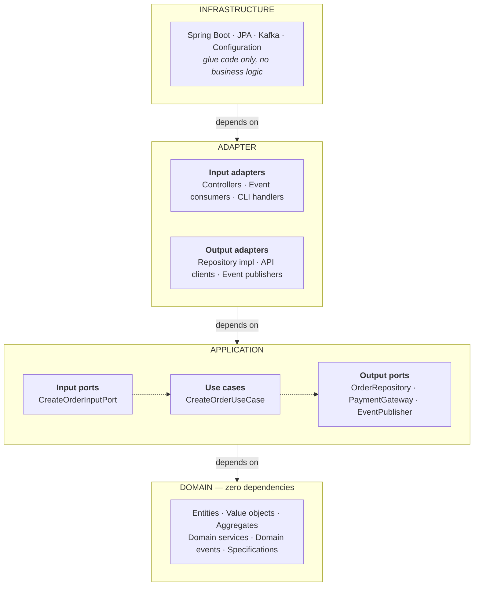
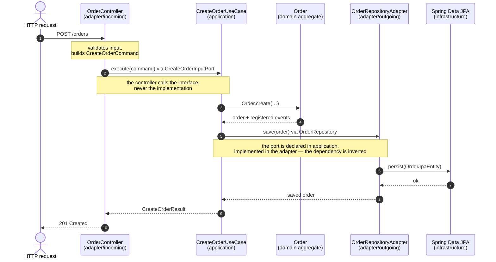

# Dependency Structure

## Layer Dependency Flow



## Request Flow with Dependency Inversion



## Cross-Bounded Context Communication

```
Order Context                                     Inventory Context
┌───────────────────────┐                        ┌─────────────────────┐
│ CreateOrderUseCase    │                        │ ReserveStockUseCase │
│ (application)         │                        │ (application)       │
└───────────┬───────────┘                        └──────────┬──────────┘
            │ publishes                                     ↑ calls
            ↓                                               │
┌───────────────────────┐                                   │
│ OrderCreated          │                                   │
│ (domain event)        │                                   │
└───────────┬───────────┘                                   │
            │ via DomainEventPublisher                      │
            ↓                                               │
┌───────────────────────┐                                   │
│ OrderEventMapper      │                                   │
│ (adapter/outgoing)    │                                   │
└───────────┬───────────┘                                   │
            │ converts to DTO                               │
            ↓                                               │
┌───────────────────────┐                                   │
│ OrderCreatedEvent     │                                   │
│ (integration event)   │                                   │
└───────────┬───────────┘                                   │
            │                                               │
            └────────→ Message Broker ─────────┐            │
                      (Kafka/RabbitMQ)         │            │
                                               │            │
                                               ↓            │
                          ┌─────────────────────────────────┐
                          │ OrderEventConsumer              │
                          │ (adapter/incoming)              │
                          └──────────┬──────────────────────┘
                                     │ via ACL
                                     ↓
                          ┌─────────────────────────────────┐
                          │ ExternalEventToCommandMapper    │
                          │ (Anti-Corruption Layer)         │
                          │ converts to ReserveStockCommand │
                          └─────────────────────────────────┘
                                     │
                          ┌──────────┘
                          │
                          ↓
                    ┌────────────────────┐
                    │ ReserveStockInput  │
                    │ Port (application) │
                    └────────────────────┘
```

## Complete Cross-Context Event Flow

(Event flow diagram included - see original document for full details)

## Allowed Dependencies

- ✅ Infrastructure → Adapter
- ✅ Adapter → Application
- ✅ Application → Domain
- ✅ Adapter → Port (interface)
- ✅ Outgoing adapter → global and own-module Infrastructure
- ✅ Use Case → Domain
- ✅ Use Case → Output Port (interface)
- ✅ Controller → Input Port (interface)
- ✅ Outer → Inner (always)

## Forbidden Dependencies

- ❌ Domain → Application
- ❌ Domain → Adapter
- ❌ Domain → Infrastructure
- ❌ Application → Adapter
- ❌ Application → Infrastructure
- ❌ Incoming adapter → Infrastructure (`DCA-HEX-004`)
- ❌ Outgoing adapter → *another module's* Infrastructure (`DCA-HEX-005`)
- ❌ Use Case → Controller
- ❌ Use Case → Repository Implementation
- ❌ Port → Adapter (implementation)
- ❌ Inner → Outer (never)

## What an adapter may inject

Allowed in either direction:

- **Application components** — an input port in an incoming adapter, an output port the adapter implements
- **Domain objects**, transitively through the application layer
- **External frameworks and libraries** — `@RestController`, a `KafkaTemplate`, an HTTP client
- **Shared-kernel types** — universal value objects, shared application ports, and the shared
  kernel's own infrastructure

**Infrastructure depends on the direction of the adapter**, and this is where the two halves of the
adapter layer part company:

- An **incoming adapter** reaches no infrastructure at all — neither the global
  `{base}.infrastructure` nor its own module's `{module}.infrastructure` (`DCA-HEX-004`). A
  controller that needs a technical capability declares an output port for it; something has to
  implement that port, and a controller is not that something.
- An **outgoing adapter** may use the global infrastructure and its own module's infrastructure —
  that is where a persistence adapter meets the `EntityManager` your configuration produced. What it
  may not touch is *another* module's infrastructure (`DCA-HEX-005`), which would tie two contexts
  together through their wiring.

```java
// adapter/incoming/web/OrderRestController.java
@RestController
class OrderRestController {
    private final CreateOrderInputPort createOrder;     // ✅ input port
    private final KafkaTemplate<String, String> kafka;  // ✅ external library
    private final DatabaseConfig config;                // ❌ infrastructure — not from here
}

// adapter/outgoing/persistence/JpaOrderRepository.java
@Component
class JpaOrderRepository implements OrderRepository {
    private final EntityManagerFactory factory;         // ✅ own module's infrastructure
    private final PaymentDataSourceConfig foreign;      // ❌ another module's infrastructure
}
```

## Infrastructure is not the same as framework

An external framework is a library you depend on; your infrastructure layer is code you wrote to
wire that framework up. The two are governed differently. `@RestController` on an incoming adapter is
a framework annotation and always correct; a reference from that same controller to your own
`MetricsConfiguration` is a dependency on infrastructure and is not. Read a complaint about
"infrastructure" as being about your own wiring code, never about the library it configures.

## Fixing a dependency that points the wrong way

When an adapter needs something that sits in infrastructure, one of three moves resolves it:

1. **Declare it as an output port.** The interface goes into the application layer, the
   implementation into `adapter/outgoing`.

   ```java
   // {context}/application/shared/MetricsPublisher.java
   public interface MetricsPublisher extends OutputPort {
       void increment(String metric);
   }

   // {context}/adapter/outgoing/metrics/PrometheusMetricsAdapter.java
   class PrometheusMetricsAdapter implements MetricsPublisher { /* … */ }
   ```

2. **Move it into the shared kernel** when it is framework-agnostic and every context needs it.

3. **Move the concern into the use case.** Often the adapter should not have had it at all — the
   application layer is where the decision belongs.
