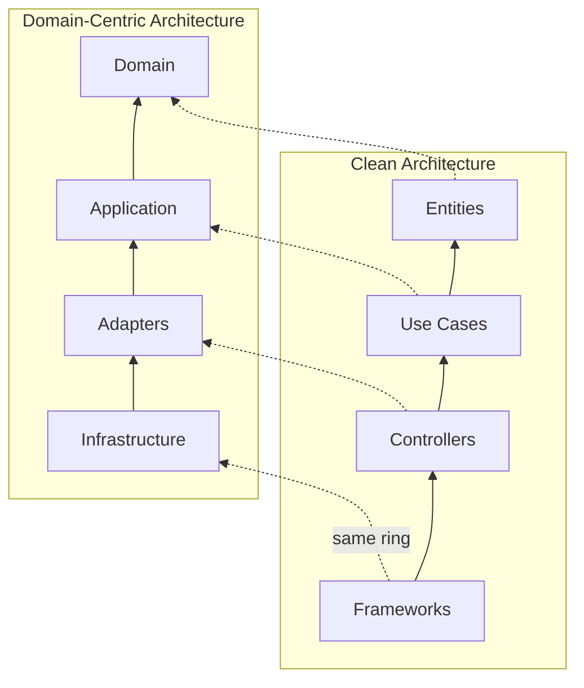

# Domain-Centric Architecture vs Clean Architecture
*Understanding the Differences and When to Use Each*

> **📘 Prerequisites:** This document compares Domain-Centric Architecture with Clean Architecture. Read [Domain-Centric Architecture](../README.md) first to understand the approach being compared.

## Introduction

**Domain-Centric Architecture** and **Clean Architecture** share many principles but differ in emphasis, terminology, and specific patterns. This document clarifies:

- What is Clean Architecture?
- How are they similar?
- How do they differ?
- When to use which approach?

## What is Clean Architecture?

**Clean Architecture**, introduced by Robert C. Martin ("Uncle Bob"), is an architectural pattern that emphasizes:

1. **Independence** - Business logic independent of frameworks, UI, database
2. **Testability** - Core logic testable without external dependencies
3. **Flexibility** - Easy to change UI, database, or framework
4. **Separation of Concerns** - Clear boundaries between layers

### Clean Architecture Layers

```text
┌─────────────────────────────────────────────┐
│  Frameworks & Drivers (outermost)           │
│  - Web, UI, Database, External Interfaces   │
└─────────────────────────────────────────────┘
                    ↓
┌─────────────────────────────────────────────┐
│  Interface Adapters                         │
│  - Controllers, Gateways, Presenters        │
└─────────────────────────────────────────────┘
                    ↓
┌─────────────────────────────────────────────┐
│  Application Business Rules                 │
│  - Use Cases, Interactors                   │
└─────────────────────────────────────────────┘
                    ↓
┌─────────────────────────────────────────────┐
│  Enterprise Business Rules (innermost)      │
│  - Entities                                 │
└─────────────────────────────────────────────┘
```

**Key Principle:** Dependencies point inward. Inner layers know nothing about outer layers.

## Similarities

Both architectures share fundamental principles:

### 1. Dependency Rule

**Both agree:**
- All dependencies point inward
- Inner layers have zero dependencies on outer layers
- Core business logic is independent



The rings are the same and so is the direction — arrows point inward, and nothing inner knows
anything outer. The names differ, and one thing behind them does: what DCA calls Domain is a rich
model with aggregates and invariants, not only Entities.

### 2. Separation of Concerns

**Both agree:**
- Business logic separated from infrastructure
- Presentation separated from business logic
- Each layer has distinct responsibility

### 3. Testability

**Both agree:**
- Core business logic testable without infrastructure
- Use mocks/stubs for external dependencies
- Test pyramid: many unit tests, fewer integration tests

### 4. Framework Independence

**Both agree:**
- Business logic doesn't depend on frameworks
- Can swap frameworks without changing business logic
- Frameworks are "details"

### 5. Database Independence

**Both agree:**
- Business logic doesn't know about database
- Can swap database without changing business logic
- Persistence is a "detail"

## Key Differences

### 1. Domain Modeling (Biggest Difference)

| Aspect | Clean Architecture | Domain-Centric Architecture |
|--------|-------------------|----------------------------|
| **Entities** | Simple objects with business rules | Rich domain model (DDD) |
| **Patterns** | Entities only | Entities, Value Objects, Aggregates, Domain Services |
| **Complexity** | Simpler, procedural possible | More sophisticated domain modeling |
| **Focus** | Use Cases are central | Domain Model is central |

**Clean Architecture:**
```java
// Entity: Simple object with business rules
public class Order {
    private String id;
    private List<OrderLine> lines;

    // Simple business rules
    public boolean isValid() {
        return lines != null && !lines.isEmpty();
    }
}
```

**Domain-Centric Architecture:**
```java
// Aggregate Root: Rich domain model
public class Order implements AggregateRoot<OrderId> {
    private final OrderId id;
    private final CustomerId customerId;
    private final List<OrderLine> lines;
    private OrderStatus status;

    // Rich domain logic
    public void addOrderLine(Product product, Quantity quantity) {
        validateCanAddLine();
        OrderLine line = OrderLine.create(product, quantity);
        lines.add(line);
        registerEvent(new OrderLineAdded(id, line.getId()));
    }

    public void cancel() {
        if (!status.canTransitionTo(OrderStatus.CANCELLED)) {
            throw new InvalidOrderStateException();
        }
        this.status = OrderStatus.CANCELLED;
        registerEvent(new OrderCancelled(id, Instant.now()));
    }

    // Aggregate invariants
    private void validateCanAddLine() {
        if (status != OrderStatus.DRAFT) {
            throw new OrderNotModifiableException();
        }
    }
}
```

> **See:** [Domain-Centric Architecture - Domain Layer Rules](../architecture/rules.md#domain-layer-rules) for full DDD patterns

### 2. Strategic Design

| Aspect | Clean Architecture | Domain-Centric Architecture |
|--------|-------------------|----------------------------|
| **Bounded Contexts** | Not explicitly addressed | Central concept |
| **Ubiquitous Language** | Not emphasized | Required |
| **Context Mapping** | Not included | Explicit relationships |
| **Subdomains** | Not addressed | Core, Supporting, Generic |

**Clean Architecture:**
- Focuses on **tactical** architecture (layers, dependencies)
- Doesn't provide guidance on **strategic** boundaries

**Domain-Centric Architecture:**
- Includes both **tactical** (layers) and **strategic** (bounded contexts) design
- Explicit guidance on how to partition large systems

> **See:** [Domain-Centric Architecture - Strategic Design Rules](../architecture/rules.md#strategic-design-rules)

### 3. Domain Events

| Aspect | Clean Architecture | Domain-Centric Architecture |
|--------|-------------------|----------------------------|
| **Domain Events** | Not part of core pattern | Fundamental building block |
| **Event Types** | Not distinguished | Domain Events vs Integration Events |
| **Event-Driven** | Not emphasized | Central integration pattern |

**Clean Architecture:**
- Events not explicitly part of the pattern
- Can be added, but not core

**Domain-Centric Architecture:**
- Domain Events are first-class citizens
- Clear distinction: Domain Events (internal) vs Integration Events (external)
- Event-driven architecture built-in

**Example:**
```java
// Domain-Centric: Events as core pattern
public class CreateOrderUseCase {
    @Transactional
    public OrderId execute(CreateOrderCommand command) {
        Order order = Order.create(command);
        orders.save(order);

        // Domain event publishing
        events.publish(new OrderCreated(
            order.getId(),
            order.getCustomerId(),
            Instant.now()
        ));

        return order.getId();
    }
}
```

> **See:** [Domain-Centric Architecture - Domain Event Rules](../architecture/rules.md#domain-event-rules-internal-to-bounded-context)

### 4. Terminology

| Clean Architecture | Domain-Centric Architecture | Notes |
|-------------------|----------------------------|-------|
| **Entities** | **Domain Model** (Entities, VOs, Aggregates) | DCA is more specific |
| **Use Cases** | **Use Cases / Application Services** | Same concept |
| **Input Port** | **Input Port** | Same |
| **Output Port** | **Output Port** | Same |
| **Controllers** | **Input Adapters** | Same concept, different name |
| **Gateways** | **Output Adapters** | Same concept, different name |
| **Presenters** | **Presenters** (optional in DCA) | DCA uses DTOs more |

### 5. Package Structure

**Clean Architecture (typical):**
```text
com.company.project
├── entities/
│   ├── Order.java
│   └── Customer.java
├── usecases/
│   ├── CreateOrder.java
│   └── FindOrder.java
├── controllers/
│   └── OrderController.java
├── gateways/
│   └── OrderGateway.java
└── presenters/
    └── OrderPresenter.java
```

**Domain-Centric Architecture:**
```text
com.company.project
├── order/ (bounded context)
│   ├── domain/
│   │   ├── model/ (Entities, VOs, Aggregates)
│   │   ├── service/ (Domain Services)
│   │   └── event/ (Domain Events)
│   ├── application/
│   │   ├── port/
│   │   │   ├── in/ (Input Ports)
│   │   │   └── out/ (Output Ports)
│   │   └── usecase/ (Use Cases)
│   ├── adapter/
│   │   ├── in/ (Input Adapters)
│   │   └── out/ (Output Adapters)
│   └── infrastructure/
└── customer/ (bounded context)
```

**Key Difference:** Domain-Centric Architecture organizes by **bounded context first**, then by layer.

> **See:** [Domain-Centric Architecture - Package Structure](../architecture/package-structure.md#java-package-structure)

### 6. Presenter Pattern

**Clean Architecture:**
- **Presenters** are a core pattern
- Use Case calls Presenter to format output
- Presenter creates View Model

```java
// Clean Architecture: Presenter pattern
public class CreateOrderUseCase {
    private final CreateOrderPresenter presenter;

    public void execute(CreateOrderRequest request) {
        Order order = ...;
        presenter.present(order); // Presenter formats output
    }
}
```

**Domain-Centric Architecture:**
- **DTOs** are preferred over Presenters
- Use Case returns DTO directly
- Presenter is optional, used only for complex formatting

```java
// Domain-Centric: DTO pattern
public class CreateOrderUseCase {
    public CreateOrderResponse execute(CreateOrderCommand command) {
        Order order = ...;
        return new CreateOrderResponse(
            order.getId(),
            order.getTotalAmount()
        ); // Returns DTO directly
    }
}
```

### 7. Aggregate Pattern

**Clean Architecture:**
- No explicit Aggregate pattern
- Entities are independent
- Transactions not explicitly addressed

**Domain-Centric Architecture:**
- **Aggregates** are fundamental
- Aggregate Root controls access
- One transaction per Aggregate
- Eventual consistency between Aggregates

**Example:**
```java
// Domain-Centric: Aggregate pattern
public class Order implements AggregateRoot<OrderId> {
    private final OrderId id;
    private final List<OrderLine> lines; // Internal entities

    // Access to OrderLine only through Order (Aggregate Root)
    public void addLine(Product product, Quantity quantity) {
        OrderLine line = OrderLine.create(product, quantity);
        lines.add(line);
    }

    // No direct access to OrderLine from outside
}

// Repository only for Aggregate Root
public interface OrderRepository {
    void save(Order order); // Saves entire aggregate
    Optional<Order> findById(OrderId id);
}
```

**Repository interface placement:** Classic DDD literature (Evans, Vernon, Millett/Tune) places repository interfaces in the domain layer. DCA deliberately places them in the application layer as output ports — consistent with Hexagonal and Clean Architecture, where the use case owns the contracts it depends on. The domain then holds no opinion about persistence at all: it neither declares the interface nor knows that one exists.

> **See:** [Domain-Centric Architecture - Aggregate Rules](../architecture/rules.md#aggregate-rules)

### 8. Cross-Context Integration

**Clean Architecture:**
- Not explicitly addressed
- Assumes single application context

**Domain-Centric Architecture:**
- Explicit patterns for cross-context integration
- Anti-Corruption Layer
- Integration Events vs Domain Events
- Context Map

> **See:** [Domain-Centric Architecture - Integration Patterns](../architecture/integration-patterns.md#integration-patterns)

## Visual Comparison

### Clean Architecture Circle Diagram

```text
┌─────────────────────────────────────────────────────────┐
│                                                         │
│   ┌───────────────────────────────────────────┐        │
│   │                                           │        │
│   │   ┌─────────────────────────────────┐    │        │
│   │   │                                 │    │        │
│   │   │   ┌───────────────────────┐    │    │        │
│   │   │   │                       │    │    │        │
│   │   │   │     ENTITIES          │    │    │        │
│   │   │   │  (Business Objects)   │    │    │        │
│   │   │   │                       │    │    │        │
│   │   │   └───────────────────────┘    │    │        │
│   │   │                                 │    │        │
│   │   │      USE CASES                  │    │        │
│   │   │   (Application Business         │    │        │
│   │   │       Rules)                    │    │        │
│   │   │                                 │    │        │
│   │   └─────────────────────────────────┘    │        │
│   │                                           │        │
│   │     INTERFACE ADAPTERS                    │        │
│   │  (Controllers, Gateways,                  │        │
│   │       Presenters)                         │        │
│   │                                           │        │
│   └───────────────────────────────────────────┘        │
│                                                         │
│     FRAMEWORKS & DRIVERS                                │
│  (Web, UI, Database, Devices, External)                │
│                                                         │
└─────────────────────────────────────────────────────────┘

Dependencies point INWARD →
```

### Domain-Centric Architecture

```text
┌─────────────────────────────────────────────────────────┐
│                                                         │
│   ┌───────────────────────────────────────────┐        │
│   │                                           │        │
│   │   ┌─────────────────────────────────┐    │        │
│   │   │                                 │    │        │
│   │   │   ┌───────────────────────┐    │    │        │
│   │   │   │                       │    │    │        │
│   │   │   │     DOMAIN            │    │    │        │
│   │   │   │  Entities             │    │    │        │
│   │   │   │  Value Objects        │    │    │        │
│   │   │   │  Aggregates           │    │    │        │
│   │   │   │  Domain Services      │    │    │        │
│   │   │   │  Domain Events        │    │    │        │
│   │   │   │                       │    │    │        │
│   │   │   └───────────────────────┘    │    │        │
│   │   │                                 │    │        │
│   │   │      APPLICATION                │    │        │
│   │   │   Use Cases                     │    │        │
│   │   │   Input/Output Ports            │    │        │
│   │   │   Commands/Queries              │    │        │
│   │   │                                 │    │        │
│   │   └─────────────────────────────────┘    │        │
│   │                                           │        │
│   │     ADAPTER                               │        │
│   │  Input (Controllers, Consumers)           │        │
│   │  Output (Repositories, Publishers)        │        │
│   │                                           │        │
│   └───────────────────────────────────────────┘        │
│                                                         │
│     INFRASTRUCTURE                                      │
│  (Spring, JPA, Kafka, Configuration)                   │
│                                                         │
└─────────────────────────────────────────────────────────┘

Dependencies point INWARD →
+ Bounded Contexts organize horizontally
```

## When to Use Which?

### Use Clean Architecture When:

✅ **Simpler domains**
- Business logic is straightforward
- Less complex domain rules
- CRUD-heavy applications

✅ **Smaller teams**
- Single team
- Co-located team
- Less need for bounded contexts

✅ **Learning architecture**
- Team new to layered architecture
- Want simpler mental model
- Don't need DDD complexity

✅ **Framework flexibility is priority**
- Frequently changing frameworks
- Experimenting with different technologies
- Framework independence is critical

### Use Domain-Centric Architecture When:

✅ **Complex domains**
- Rich business logic
- Complex business rules
- Domain-driven applications

✅ **Large systems**
- Multiple bounded contexts
- Need strategic design
- Complex integrations

✅ **Multiple teams**
- Team per bounded context
- Need clear team boundaries
- Conway's Law considerations

✅ **Event-driven systems**
- Asynchronous communication
- Eventual consistency
- Microservices or modular monolith

✅ **Long-term evolution**
- System will grow over time
- Need clear boundaries for extraction
- May evolve to microservices

> **See:** [Deployment Patterns](./deployment-patterns.md) for evolution strategies

## Migration Path

### From Clean Architecture to Domain-Centric Architecture

If you have a Clean Architecture application and want to adopt Domain-Centric patterns:

**Step 1: Identify Bounded Contexts**
- Analyze your domain
- Identify natural boundaries
- Group related use cases

**Step 2: Introduce DDD Patterns**
- Enrich Entities with behavior
- Introduce Value Objects
- Define Aggregates
- Add Domain Services

**Step 3: Add Domain Events**
- Identify domain events
- Implement event publishing
- Add event handlers

**Step 4: Reorganize Packages**
- Group by bounded context
- Maintain layer structure within contexts
- Separate domain/integration events

**Step 5: Define Strategic Patterns**
- Create Context Map
- Define context relationships
- Add Anti-Corruption Layers

### From Domain-Centric Architecture to Clean Architecture

If Domain-Centric Architecture is too complex for your needs:

**Step 1: Simplify Domain Model**
- Convert complex Aggregates to simple Entities
- Remove Domain Events if not needed
- Simplify Value Objects to primitives

**Step 2: Flatten Structure**
- Remove bounded context grouping
- Organize by layer only
- Merge contexts if appropriate

**Step 3: Adopt Presenter Pattern** (optional)
- Replace DTOs with Presenters
- Add View Models
- Separate presentation logic

## Combining Best of Both

You can combine approaches:

**Hybrid Approach:**
```text
✅ Use Clean Architecture layers (from Clean Architecture)
✅ Use DDD patterns in Domain layer (from Domain-Centric)
✅ Use Presenters OR DTOs (choose what fits)
✅ Add Bounded Contexts as needed (from Domain-Centric)
✅ Add Domain Events as needed (from Domain-Centric)
```

**Example:**
```text
com.company.project
├── order/ (Bounded Context - from DCA)
│   ├── entities/ (Clean Architecture terminology)
│   │   ├── Order.java (but with DDD patterns - from DCA)
│   │   └── OrderLine.java
│   ├── usecases/ (Clean Architecture terminology)
│   │   └── CreateOrderUseCase.java
│   ├── controllers/ (Clean Architecture terminology)
│   │   └── OrderController.java
│   └── gateways/ (Clean Architecture terminology)
│       └── OrderGateway.java
```

## Summary

### Clean Architecture

**Strengths:**
- ✅ Simpler mental model
- ✅ Clear layer separation
- ✅ Framework independence
- ✅ Good for CRUD applications

**Limitations:**
- ❌ Less guidance for complex domains
- ❌ No strategic design patterns
- ❌ Limited domain modeling patterns
- ❌ No bounded context concept

### Domain-Centric Architecture

**Strengths:**
- ✅ Rich domain modeling (DDD)
- ✅ Strategic design patterns
- ✅ Bounded contexts
- ✅ Event-driven architecture
- ✅ Scales to large systems
- ✅ Multiple team support

**Limitations:**
- ❌ More complex
- ❌ Steeper learning curve
- ❌ Can be overkill for simple domains

### The Bottom Line

**Clean Architecture** is excellent for:
- Simple to medium complexity
- Framework independence focus
- Learning layered architecture

**Domain-Centric Architecture** extends Clean Architecture with:
- Domain-Driven Design patterns
- Strategic design for large systems
- Event-driven architecture
- Bounded contexts for team scaling

**Choose based on:**
- Domain complexity
- System size
- Team structure
- Long-term evolution needs

> **Remember:** You can start with Clean Architecture and evolve to Domain-Centric Architecture as your system grows in complexity.

## Cross-References

- **Core patterns:** [Domain-Centric Architecture](../README.md)
- **Deployment strategies:** [Deployment Patterns](./deployment-patterns.md)
- **Spring implementation:** [Spring Modulith Implementation](./spring-modulith.md)
- **Team structure:** [Team Topologies Integration](./team-topologies.md)

## Key References

**Clean Architecture:**
- **[Clean Architecture: A Craftsman's Guide to Software Structure and Design](https://www.informit.com/store/clean-architecture-a-craftsmans-guide-to-software-structure-9780134494166)** by Robert C. Martin (2017)
- **[The Clean Architecture](https://blog.cleancoder.com/uncle-bob/2012/08/13/the-clean-architecture.html)** - Original blog post by Uncle Bob

**Domain-Driven Design:**
- **[Domain-Driven Design: Tackling Complexity in the Heart of Software](https://www.domainlanguage.com/ddd/)** by Eric Evans (2003)
- **[Implementing Domain-Driven Design](https://vaughnvernon.com/implementing-domain-driven-design/)** by Vaughn Vernon (2013)

**Hexagonal Architecture:**
- **[Hexagonal Architecture](https://alistair.cockburn.us/hexagonal-architecture/)** by Alistair Cockburn (2005)
- **[Get Your Hands Dirty on Clean Architecture](https://thombergs.gumroad.com/l/gyhdoca)** by Tom Hombergs (2019)

For comprehensive references, see [Domain-Centric Architecture - References & Further Reading](../architecture/references.md).
