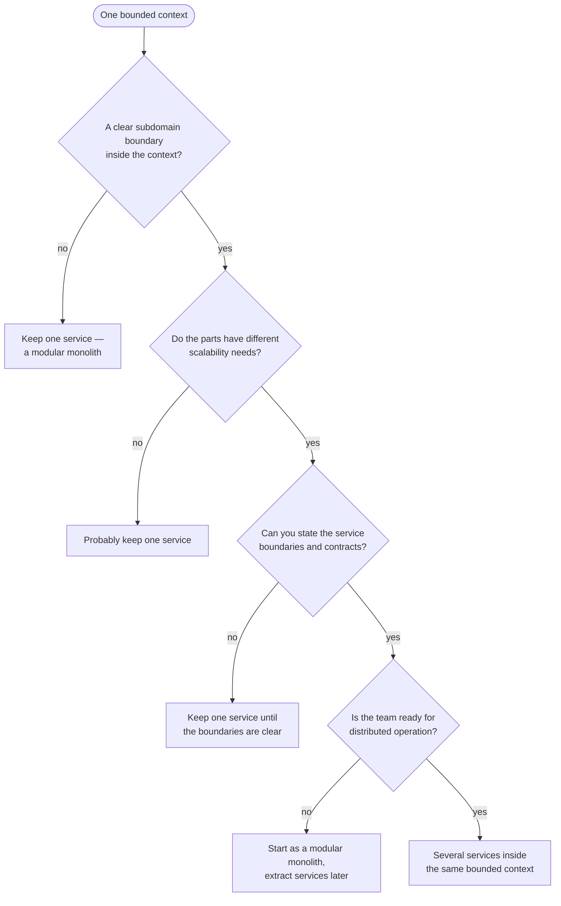
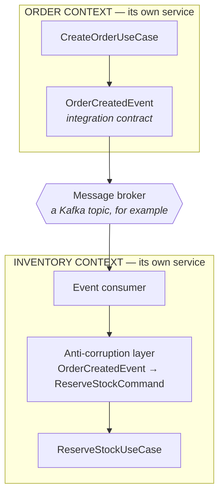
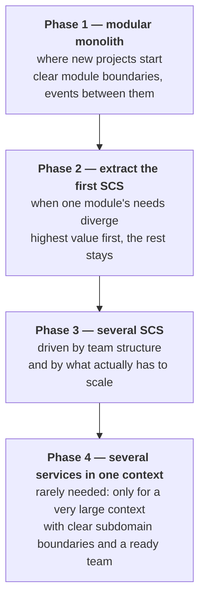

# Deployment Patterns
*Extending Domain-Centric Architecture with Deployment Strategies*

> **📘 Prerequisites:** This document extends [Domain-Centric Architecture](../README.md). Read the main document first for core architectural patterns, layers, and rules.

## Introduction

While the main [Domain-Centric Architecture](../README.md) defines the logical structure of bounded contexts and layers, this document addresses **deployment strategies** and **physical boundaries**.

**Key Distinction:**
- **Logical Boundary** = Bounded Context (DDD concept)
- **Physical Boundary** = Service/Deployment Unit (infrastructure concept)

**Core Question:** When should one Bounded Context be deployed as multiple services?

## Self-Contained Systems (SCS)

### What is SCS?

A **Self-Contained System** is an autonomous, independently deployable unit that includes:

- **UI** (if needed) - User interface components
- **Business Logic** - Domain and application layers
- **Data Storage** - Own database/schema
- **Integration** - Well-defined interfaces to other SCS

### SCS Characteristics

```
┌──────────────────────────────────────┐
│  Self-Contained System (SCS)         │
│                                      │
│  ┌──────────────────────────────┐    │
│  │ UI Layer (optional)          │    │
│  └──────────────────────────────┘    │
│  ┌──────────────────────────────┐    │
│  │ Business Logic               │    │
│  │ (Domain + Application)       │    │
│  └──────────────────────────────┘    │
│  ┌──────────────────────────────┐    │
│  │ Data Storage                 │    │
│  │ (own database)               │    │
│  └──────────────────────────────┘    │
│                                      │
│  Boundaries:                         │
│  - Autonomous deployment             │
│  - Isolated data                     │
│  - Independent release cycle         │
│  - Clear integration points          │
└──────────────────────────────────────┘
```

**SCS Principles:**
- **Autonomy** - Can be developed, deployed, and scaled independently
- **No shared data** - Each SCS owns its data
- **Integration via contracts** - Events or APIs
- **Technology heterogeneity** - Different tech stacks possible
- **Team ownership** - One team owns one SCS (typically)

### Bounded Context vs SCS

| Aspect | Bounded Context | Self-Contained System |
|--------|-----------------|------------------------|
| **Concept** | Logical boundary (DDD) | Physical boundary (deployment) |
| **Defines** | Model boundary | Deployment unit |
| **Granularity** | Language/model consistency | Autonomous service |
| **Relationship** | 1 BC can have 1+ SCS | 1 SCS contains ≤ 1 BC |
| **Goal** | Model clarity | Deployment autonomy |

**Typical Mapping:**
```
Bounded Context = Self-Contained System (common)
```

**Alternative Mapping:**
```
1 Bounded Context = Multiple Services (advanced)
```

> **When to use multiple services per BC:** See [Service Decomposition](#service-decomposition) below.

## Service Decomposition

### Why Split a Bounded Context into Multiple Services?

**Reasons:**
1. **Scalability** - Different parts need different scaling strategies
2. **Technology** - Different parts benefit from different tech stacks
3. **Team organization** - Large BC owned by multiple sub-teams
4. **Performance** - Isolated optimization of critical paths
5. **Deployment** - Independent release cycles for different capabilities

**Caution:** Only do this when benefits clearly outweigh complexity.

### Internal Events vs Integration Events

When you split a Bounded Context into multiple services, you need **two types of events**:

#### Integration Events (Cross-Bounded Context)
- **Purpose:** Communication between different bounded contexts
- **Visibility:** Public to all bounded contexts
- **Characteristics:**
  - Versioned and documented
  - Backward compatible
  - Anti-Corruption Layer at consumer
  - Represent public contracts
- **Example:** `OrderCreatedEvent` published by Order BC, consumed by Inventory BC

For core event patterns, see [Domain-Centric Architecture - Event Rules](../architecture/rules.md#domain-event-rules-internal-to-bounded-context).

#### Internal Events (Within Bounded Context, Across Services)
- **Purpose:** Communication between services within same bounded context
- **Visibility:** Internal to bounded context only
- **Characteristics:**
  - Same ubiquitous language
  - Less strict versioning (same team controls both sides)
  - No Anti-Corruption Layer needed (trust within context)
  - Not exposed to other bounded contexts
- **Example:** `OrderLineAddedInternalEvent` between Order Management Service and Order Pricing Service (both in Order BC)

**Key Distinction:**
```
Order BC (Single Bounded Context)
├── Order Management Service
│   └── publishes: OrderLineAddedInternalEvent
│
└── Order Pricing Service
    └── consumes: OrderLineAddedInternalEvent

Both services share the ubiquitous language.
Internal event stays within Order BC boundary.

External systems (Inventory BC, Customer BC) NEVER see this internal event.
They only see public Integration Events like OrderCreatedEvent.
```

### Decision Tree: When to Decompose?



**Default Recommendation:** Start with **one service per bounded context** (modular monolith or single SCS). Extract services later when needed.

> **Note:** For Spring Modulith modular monolith patterns, see [Spring Modulith Implementation](./spring-modulith.md).

### Multi-Service Package Structure Example

**Scenario:** Order Bounded Context split into 3 services

```
order-bounded-context/ (Git Repository)
│
├── order-management-service/
│   └── src/main/java/com/company/order/management/
│       ├── domain/
│       │   └── model/
│       │       ├── Order.java (Aggregate Root)
│       │       ├── OrderLine.java
│       │       └── OrderStatus.java
│       ├── application/
│       │   ├── port/
│       │   │   ├── in/
│       │   │   │   ├── CreateOrderInputPort.java
│       │   │   │   └── AddOrderLineInputPort.java
│       │   │   └── out/
│       │   │       ├── OrderRepository.java
│       │   │       └── InternalEventPublisher.java
│       │   └── usecase/
│       │       ├── CreateOrderUseCase.java
│       │       └── AddOrderLineUseCase.java
│       ├── adapter/
│       │   ├── incoming/
│       │   │   └── web/
│       │   │       └── OrderController.java
│       │   └── outgoing/
│       │       ├── persistence/
│       │       │   └── OrderRepositoryAdapter.java
│       │       └── messaging/
│       │           └── InternalEventPublisherAdapter.java
│       └── infrastructure/
│           └── config/
│
├── order-pricing-service/
│   └── src/main/java/com/company/order/pricing/
│       ├── domain/
│       │   └── model/
│       │       ├── PriceCalculation.java (Aggregate Root)
│       │       └── PricingRule.java
│       ├── application/
│       │   ├── port/
│       │   │   ├── in/
│       │   │   │   └── CalculatePriceInputPort.java
│       │   │   └── out/
│       │   │       └── PriceRepository.java
│       │   └── usecase/
│       │       └── CalculatePriceUseCase.java
│       ├── adapter/
│       │   ├── incoming/
│       │   │   └── messaging/
│       │   │       └── OrderEventConsumer.java
│       │   │           (consumes OrderLineAddedInternalEvent)
│       │   └── outgoing/
│       │       └── persistence/
│       │           └── PriceRepositoryAdapter.java
│       └── infrastructure/
│           └── config/
│
├── order-notification-service/
│   └── src/main/java/com/company/order/notification/
│       ├── domain/
│       ├── application/
│       ├── adapter/
│       │   ├── incoming/
│       │   │   └── messaging/
│       │   │       └── OrderEventConsumer.java
│       │   │           (consumes OrderCreatedInternalEvent)
│       │   └── outgoing/
│       │       └── email/
│       │           └── EmailServiceAdapter.java
│       └── infrastructure/
│
└── shared-internal/ (Shared within Order BC only)
    └── events/
        ├── OrderCreatedInternalEvent.java
        ├── OrderLineAddedInternalEvent.java
        └── OrderCancelledInternalEvent.java
```

**Key Points:**
- All services are in same Git repo (monorepo) OR separate repos with shared library
- All services share ubiquitous language (same BC)
- Internal events (`*InternalEvent`) shared via `shared-internal/` module
- Integration events (`*Event`) published to external BCs separately
- Each service follows domain-centric architecture layers
- Each service can be deployed independently

### Internal Event Communication Pattern

```
┌─────────────────────────────────────────────────────────────────┐
│                 ORDER BOUNDED CONTEXT                           │
│                                                                 │
│  ┌──────────────────────────┐                                   │
│  │ Order Management Service │                                   │
│  │                          │                                   │
│  │  AddOrderLineUseCase     │                                   │
│  │        │                 │                                   │
│  │        ↓                 │                                   │
│  │  publishes:              │                                   │
│  │  OrderLineAddedInternal  │                                   │
│  │  Event                   │                                   │
│  └───────────┬──────────────┘                                   │
│              │                                                  │
│              │ via Internal Message Broker                      │
│              │ (within same BC, not exposed externally)         │
│              ↓                                                  │
│  ┌────────────────────────────┐                                 │
│  │ Order Pricing Service      │                                 │
│  │                            │                                 │
│  │  OrderEventConsumer        │                                 │
│  │        │                   │                                 │
│  │        ↓                   │                                 │
│  │  consumes:                 │                                 │
│  │  OrderLineAddedInternal    │                                 │
│  │  Event                     │                                 │
│  │        │                   │                                 │
│  │        ↓                   │                                 │
│  │  CalculatePriceUseCase     │                                 │
│  └────────────────────────────┘                                 │
│                                                                 │
│  No ACL needed - same ubiquitous language within BC             │
└─────────────────────────────────────────────────────────────────┘
```

**Contrast with Integration Events:**


The anti-corruption layer is not optional here: the two contexts speak different ubiquitous
languages, and the contract is written in the producer's.

## Deployment Pattern Comparison

### Pattern 1: Modular Monolith (Single Deployment Unit)

**Structure:**
```
Single Deployment Unit
┌──────────────────────────────────────┐
│  Spring Boot Application             │
│                                      │
│  ┌────────┐ ┌────────┐ ┌──────────┐  │
│  │ Order  │ │Customer│ │Inventory │  │
│  │ Module │ │ Module │ │ Module   │  │
│  └────────┘ └────────┘ └──────────┘  │
│                                      │
│  Shared Database                     │
└──────────────────────────────────────┘
```

**Characteristics:**
- ✅ Simple deployment
- ✅ Simple transactions (ACID)
- ✅ Simple development
- ✅ Fast inter-module calls
- ❌ Single technology stack
- ❌ Coupled deployment
- ❌ Difficult to scale parts independently

**When to Use:**
- Starting new projects
- Small to medium complexity
- Single team or co-located teams
- Clear module boundaries exist

**Implementation:** See [Spring Modulith Implementation](./spring-modulith.md)

### Pattern 2: Self-Contained Systems (Multiple SCS)

**Structure:**
```
┌──────────────┐     ┌──────────────┐     ┌──────────────┐
│  Order SCS   │     │ Customer SCS │     │Inventory SCS │
│              │     │              │     │              │
│ ┌──────────┐ │     │ ┌──────────┐ │     │ ┌──────────┐ │
│ │ Domain   │ │     │ │ Domain   │ │     │ │ Domain   │ │
│ └──────────┘ │     │ └──────────┘ │     │ └──────────┘ │
│ ┌──────────┐ │     │ ┌──────────┐ │     │ ┌──────────┐ │
│ │ Own DB   │ │     │ │ Own DB   │ │     │ │ Own DB   │ │
│ └──────────┘ │     │ └──────────┘ │     │ └──────────┘ │
└──────────────┘     └──────────────┘     └──────────────┘
       ↕                     ↕                     ↕
       └─────────── Events / APIs ─────────────────┘
```

**Characteristics:**
- ✅ Independent deployment
- ✅ Independent scaling
- ✅ Technology diversity possible
- ✅ Clear boundaries
- ✅ Team autonomy
- ❌ Distributed system complexity
- ❌ Eventual consistency
- ❌ More operational overhead

**When to Use:**
- Clear bounded contexts
- Different scaling needs
- Multiple autonomous teams
- Mature DevOps capability

**Mapping:** Typically 1 Bounded Context = 1 SCS

### Pattern 3: Multi-Service Bounded Context (Advanced)

**Structure:**
```
Order Bounded Context
┌─────────────────────────────────────────────────────────┐
│                                                         │
│  ┌──────────────┐  ┌──────────────┐  ┌──────────────┐   │
│  │ Management   │  │ Pricing      │  │ Notification │   │
│  │ Service      │  │ Service      │  │ Service      │   │
│  │              │  │              │  │              │   │
│  │ ┌──────────┐ │  │ ┌──────────┐ │  │ ┌──────────┐ │   │
│  │ │ Domain   │ │  │ │ Domain   │ │  │ │ Domain   │ │   │
│  │ └──────────┘ │  │ └──────────┘ │  │ └──────────┘ │   │
│  │ ┌──────────┐ │  │ ┌──────────┐ │  │ ┌──────────┐ │   │
│  │ │ Own DB   │ │  │ │ Own DB   │ │  │ │ Own DB   │ │   │
│  │ └──────────┘ │  │ └──────────┘ │  │ └──────────┘ │   │
│  └──────────────┘  └──────────────┘  └──────────────┘   │
│         ↕                  ↕                  ↕         │
│         └──── Internal Events (within BC) ────┘         │
│                                                         │
└─────────────────────────────────────────────────────────┘
         │
         ↓ Integration Events
         │
    Other Bounded Contexts
```

**Characteristics:**
- ✅ Independent scaling within BC
- ✅ Independent deployment within BC
- ✅ Technology diversity within BC
- ✅ Shared ubiquitous language
- ❌ High complexity
- ❌ Distributed transactions within BC
- ❌ Internal events + integration events

**When to Use:**
- Very large bounded context
- Clear subdomains within BC
- Different scaling/tech needs within BC
- Very mature teams

**Caution:** This is the most complex pattern. Only use when benefits are clear and substantial.

## Migration Path

### Recommended Evolution



**Anti-Pattern:** Starting with microservices before understanding domain boundaries.

**Best Practice:** Start simple (modular monolith), extract services when pain points emerge.

> **Implementation Note:** Spring Modulith provides excellent support for Phase 1 (modular monolith) with clear extraction paths to Phase 2. See [Spring Modulith Implementation](./spring-modulith.md).

## Summary

**Key Takeaways:**

1. **Bounded Context ≠ Service** - They can align, but don't have to
2. **Start Simple** - Modular monolith first, extract services later
3. **Clear Boundaries** - Whether monolith or services, enforce bounded context boundaries
4. **Internal vs Integration Events** - Different purposes, different rules
5. **Team Alignment** - Let team structure guide service boundaries

**Cross-References:**
- Core architecture patterns: [Domain-Centric Architecture](../README.md)
- Modular monolith implementation: [Spring Modulith Implementation](./spring-modulith.md)
- Team structure alignment: [Team Topologies Integration](./team-topologies.md)
